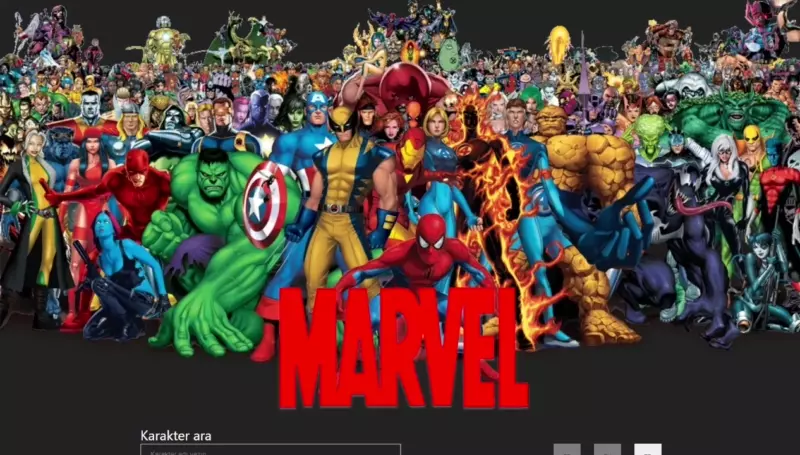
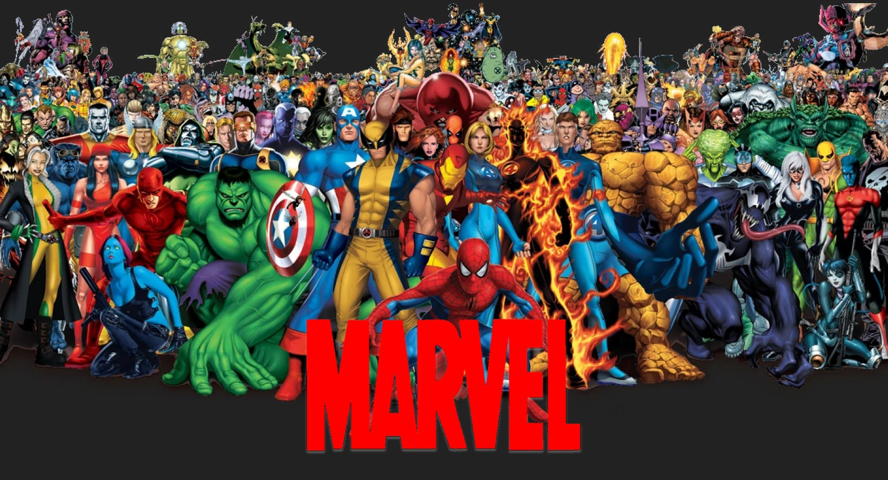

[](https://github.com/infraform/react-marvel-api/actions/workflows/dockerx.yml) [](https://github.com/infraform/react-marvel-api/actions/workflows/CloudFormation.yml)

# Marvel API with React.js

## Description

Marvel Web Application built with React.js. This is a simple web application that displays the Marvel Comics database. The application is built with React.js.

## Using GitHub Actions with CloudFormation

The application is deployed on AWS EC2 instance using Amazon Web Services CloudFormation. CloudFormation is an Infrastructure as a Service (IaaS) service that provides a platform for creating and managing AWS resources and allows you to create, update, and delete AWS resources. Creating AWS CloudFormation stack for building infrastructure for the application is triggered by GitHub Actions. GitHub Actions is a continuous integration platform that allows you to build and deploy applications on GitHub and manage your CI/CD pipelines.



## Installation

- First, clone the project:

  ```
  git clone https://github.com/infraform/react-marvel-api.git
  ```

- Install dependencies with npm

  ```
  npm install
  ```

- or install dependencies with yarn

  ```
  yarn install
  ```

- Start the project on localhost port: 3000 with using npm or yarn

  ```
  npm start
  ```

  ```
  yarn start
  ```

## Output



## Usage

- You can use auto complete feature in the search bar.

- You can see the Marvel Comics characters in the table by clicking the search results or items on the web page.

- Multi Language support:
  - English
  - Turkish
  - French

## Contributors

- [Burak Caniklioğlu](https://github.com/burak-caniklioglu)

- [Enes Turan](https://github.com/devenes)
